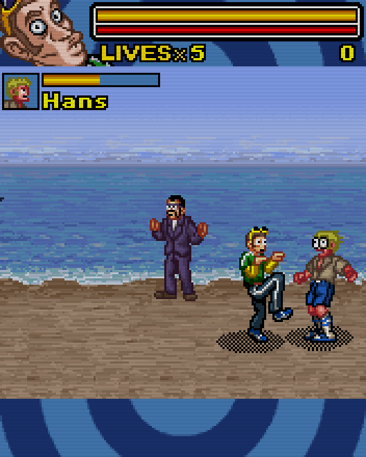

# Acion Neng (2006)

## Descripción
Un "Yo contra el barrio" basado en el personaje del *Neng*.

## Créditos
- **Programación**: 
Jimmy Anttila 
Moisés Moreno

- **Gráficos**: 
Pablo A. Sánchez 
Griselda Llada

- **Musica**: 
José Vázquez

## Descargas
- [J2ME](jars/j2me/ActionNeng_176x220.jar?raw=true)
- [PC](jars/pc/ActionNeng.jar?raw=true)
