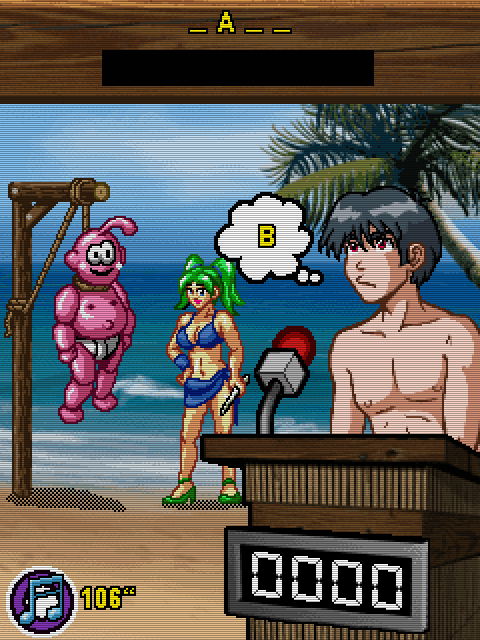

# El Show del Ahorcado (2006)

## Descripción
Símpatico juego del ahorcado que simula un concurso de TV.

## Créditos
- **Programación**: 
Moisés Moreno

- **Gráficos**: 
Pablo A. Sánchez 
Griselda Llada

- **Música**: 
José Vázquez

## Descargas
- [J2ME](jars/j2me/Ahorcado_240x320.jar?raw=true)
- [PC](jars/pc/Ahorcado.jar?raw=true)
