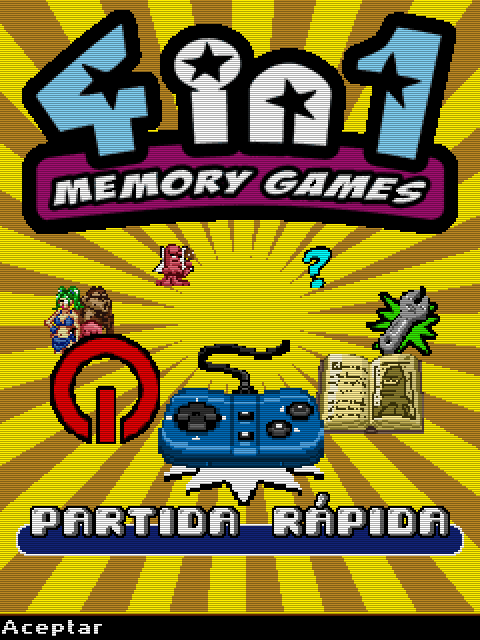
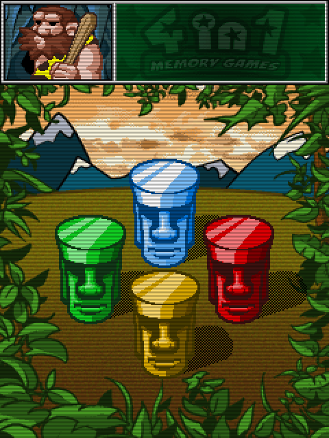

# 4 en 1 - Memory Games
[</img>](screenshots/CuatroEnUno_title.png)
[</img>](screenshots/CuatroEnUno_menu.png)
[</img>](screenshots/CuatroEnUno_game.png)

## Descripción
Serie de minijuegos sencillos para pasar el rato:
- **Masterbrain**: Versión del Mastermind.
- **Parejas**: Memoriza y descubre las parejas ocultas.
- **Colores**: Versión del Simón.
- **Memorión**: Memoriza lo que ves y responde a la pregunta.

## Comentarios
Es un juego simple sin muchas pretensiones.

## Créditos
- **Programación**: 
Moisés Moreno

- **Gráficos**: 
Pablo A. Sánchez 
Griselda Llada

- **Música**: 
José Vázquez

## Descargas
- [J2ME](jars/j2me/CuatroEnUno_240x320.jar)
- [PC](jars/pc/CuatroEnUno.jar)
