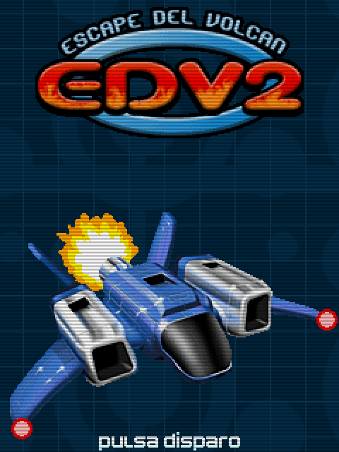

# Escape del Volcán 2 (2007)
[</img>](screenshots/EdV2_title.png)
[</img>](screenshots/EdV2_menu.png)
[</img>](screenshots/EdV2_game.png)

## Descripción
Segunda parte de [Escape del Volcán](Escape.md) que conserva el espíritu del primero, pero añadiendo objetos, enemigos y naves desbloqueables.

Personalmente quedé bastante satisfecho con el resultado final. Creo que es bastante completo y divertido. Eso sí, al igual que el primero, también es bastante difícil.

## Créditos
- **Programación**: 
Moisés Moreno

- **Gráficos**: 
Pablo A. Sánchez

## Descargas
- [J2ME](jars/j2me/EdV2_240x320.jar?raw=true)
- [PC](jars/pc/EdV2.jar?raw=true)
- **Próximamente**: Versión mejorada para PC.