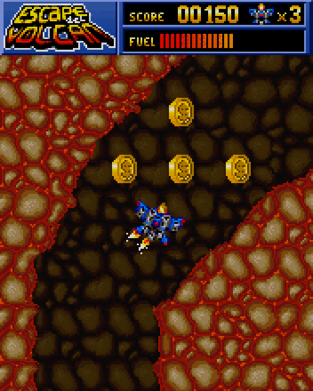

# Escape del Volcán (2005)
[</img>](screenshots/Escape_menu.png)
[</img>](screenshots/Escape_game.png)

## Descripción
Juego de habilidad cuyo objetivo es escapar de todos los volcanes antes de que te atrape la lava o te quedes sin combustible mientras intentas coger todas las monedas.

Tengo un cariño especial por este juego, ya que fue el primero que hice para J2ME. Está basado en un minijuego que presenté en un concurso de programación en 24h.

Un juego simple pero resultón. Bastante difícil, pero divertido si te gustan los retos. Sobre todo si quieres conseguir todas las monedas.

## Créditos
- **Programación**: 
Moisés Moreno

- **Gráficos**: 
Pablo A. Sánchez

## Descargas
- [J2ME](jars/j2me/Escape_176x220.jar?raw=true)
- [PC](jars/pc/Escape.jar?raw=true)