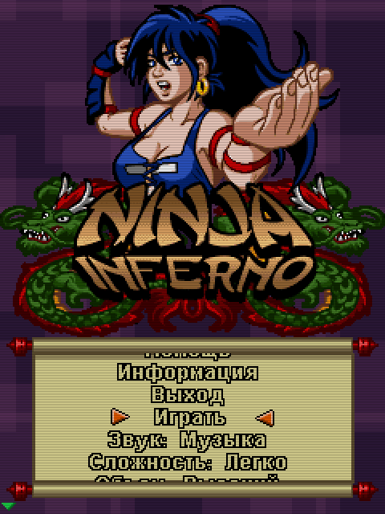

# Ninja Inferno (2007)

## Descripción
Juego inspirado en Kung-Fu Master. Por desgracia sólo he encontrado una versión en ruso...

## Créditos
- **Programación**: 
Ignacio Roda 
Moisés Moreno

- **Gráficos**: 
Pablo A. Sánchez 
Griselda Llada

- **Musica**: 
Manu Fernández

## Descargas
- [J2ME](jars/j2me/NinjaInferno_240x320.jar?raw=true)
- [PC](jars/pc/NinjaInferno.jar?raw=true)
