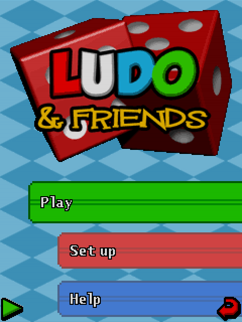

# Parchís and Friends (2008)

## Descripción
Juego de Futvoley inspirado en **Power Spikes**. Podría haber sido un juego divertido, pero la jugabilidad deja bastante que desear.

## Créditos
- **Programación**: 
Ignacio Roda 
Moisés Moreno

- **Gráficos**: 
Pablo A. Sánchez

- **Musica**: 
José Vázquez

## Descargas
- [J2ME](jars/j2me/ParchisAndFriends_240x320.jar?raw=true)
- [PC](jars/pc/ParchisAndFriends.jar?raw=true)
