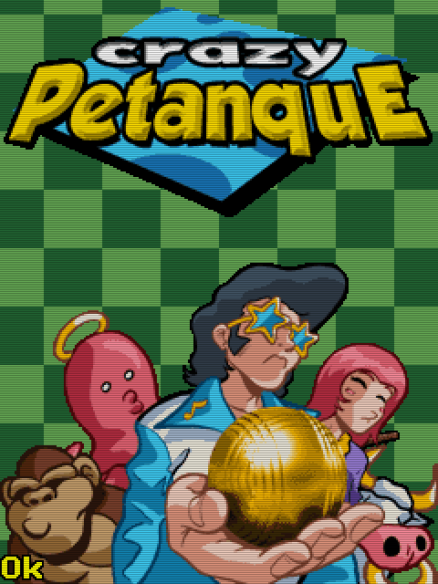

# Crazy Petanca (2006)

## Descripción
Juego de Petanca. No puedo decir muchos más... no sé jugar a la Petanca.

## Créditos
- **Programación**: 
Jimmy Anttila 
Moisés Moreno

- **Gráficos**: 
Pablo A. Sánchez 
Griselda Llada

- **Musica**: 
José Vázquez

## Descargas
- [J2ME](jars/j2me/Petanca_240x320.jar?raw=true)
- [PC](jars/pc/Petanca.jar?raw=true)
