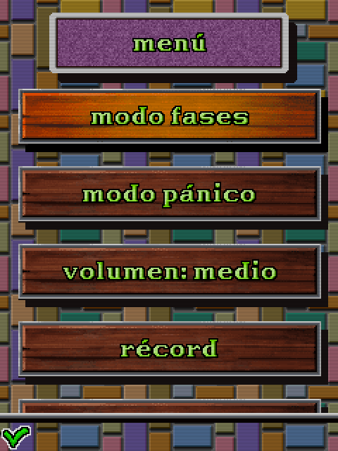
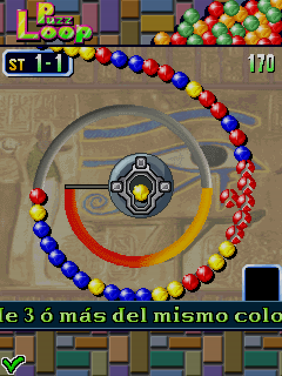

# PuzzLoop (2008)

## Descripción
Conversión oficial del juego arcade PuzzLoop.

## Créditos
- **Programación**: 
Moisés Moreno 
José Jimeno

- **Gráficos**: 
Pablo A. Sánchez 
Griselda Llada

## Descargas
- [J2ME](jars/j2me/PuzzLoop_240x320.jar?raw=true)
- [PC](jars/pc/PuzzLoop.jar?raw=true)
