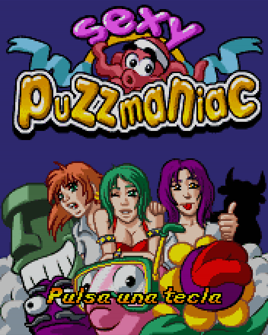

# Sexy Puzzmaniac (2005)

## Descripción
Juego tipo Volfied o Gals Panic.

Mi segundo juego para J2ME. Posiblemente el mejor acabado de todos los que hice, aunque técnicamente fuera superado por otros. Pudimos hacerlo con calma y metimos todo lo que queríamos.

## Créditos
- **Programación**: 
Moisés Moreno 
José Jimeno

- **Gráficos**: 
Pablo A. Sánchez 
Griselda Llada

## Descargas
- [J2ME](jars/j2me/Puzzmaniac_176x220.jar?raw=true)
- [PC](jars/pc/Puzzmaniac.jar?raw=true)
- **Próximamente**: Versión adaptada a PC.
