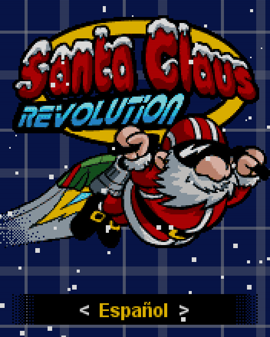

# Santa Claus Revolution (2005)
[</img>](screenshots/SantaRev_menu.png)
[</img>](screenshots/SantaRev_game.png)

## Descripción
Adaptación navideña de [Escape del Volcán](Escape.md). Conserva misma jugabilidad, pero añadiendo distintos niveles de dificultad que requieren conseguir un determinado número de regalos para pasar de nivel.

Empezaban a decir que era un sádico por hacer juegos tan difíciles.

## Créditos
- **Programación**: 
Moisés Moreno

- **Gráficos**: 
Pablo A. Sánchez 
Griselda Llada

## Descargas
- [J2ME](jars/j2me/SantaRev_176x220.jar?raw=true)
- [PC](jars/pc/SantaRev.jar?raw=true)