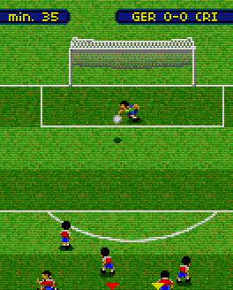
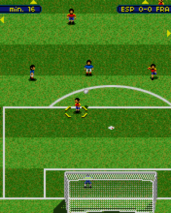

# Soccer Revolution (2006)
[</img>](screenshots/SoccerRevolution_game.png)
[</img>](screenshots/SoccerRevolution_game2.png)

## Descripción
Juego de fútbol estilo Sensible Soccer.

Aunque no me gusta el fútbol y tampoco me llamaba la idea de hacer un juego, me lo pasé bastante bien programándolo.

Lamentablemente no he conseguido recuperarlo todavía.

## Créditos
- **Programación**: 
Moisés Moreno (juego) 
Ignacio Roda (menús)

- **Gráficos**: 
Pablo A. Sánchez 
Griselda Llada

- **Musica**: 
Julián Ortiz

## Descargas
- J2ME (no disponible)
- PC (no disponible)