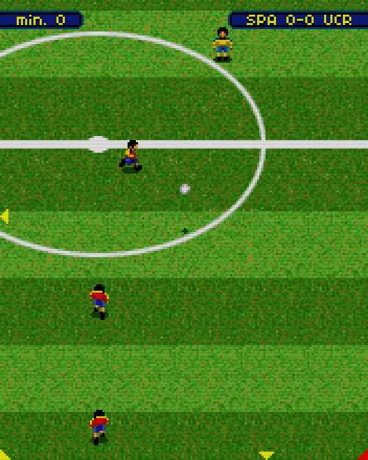

# Soccer Revolution (2006)

## Descripción
Juego de fútbol estilo Sensible Soccer.

Aunque no me gusta el fútbol y tampoco me llamaba la idea de hacer un juego, me lo pasé bastante bien programándolo.

Sólo he conseguido una versión rara (de Samsung, creo) para una resolución algo pequeña y he tenido que "hackearlo" para que funcione el teclado.

## Créditos
- **Programación**: 
Moisés Moreno (juego) 
Ignacio Roda (menús)

- **Gráficos**: 
Pablo A. Sánchez 
Griselda Llada

- **Musica**: 
Julián Ortiz

## Descargas
- [J2ME](jars/j2me/SoccerRevolution_132x164.jar?raw=true)
- [PC](jars/pc/SoccerRevolution.jar?raw=true)
