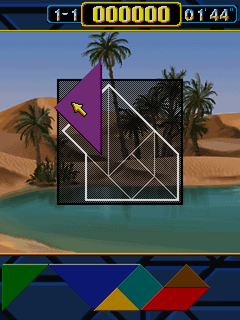

# Tangram (2006)

## Descripción
Adaptación del Tangram para móviles que consiste en formar diferentes figuras con las piezas disponibles.

## Créditos
- **Programación**: 
Moisés Moreno

- **Gráficos**: 
Pablo A. Sánchez
Griselda Llada

- **Música**: 
José Vázquez

## Descargas
- [J2ME](jars/j2me/Tangram_240x320.jar?raw=true)
- [PC](jars/pc/Tangram.jar?raw=true)