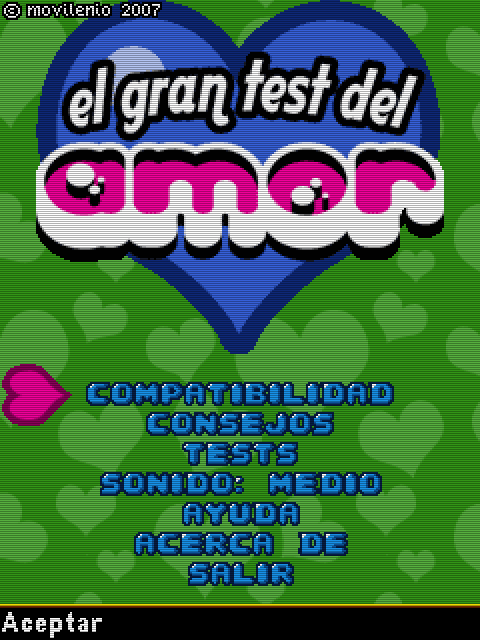
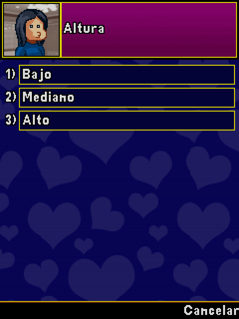

# El Gran Test del Amor (2007)

## Descripción
Juego, por llamarle algo, que incluía algunos tests de compatibiliad y consejos para ligar. Supongo que uno no puede estar orgulloso de todo lo que hace.

## Créditos
- **Programación**: 
Moisés Moreno

- **Gráficos**: 
Pablo A. Sánchez 
Griselda Llada

- **Música**: 
José Vázquez

## Descargas
- [J2ME](jars/j2me/TestAmor_240x320.jar?raw=true)
- [PC](jars/pc/TestAmor.jar?raw=true)
