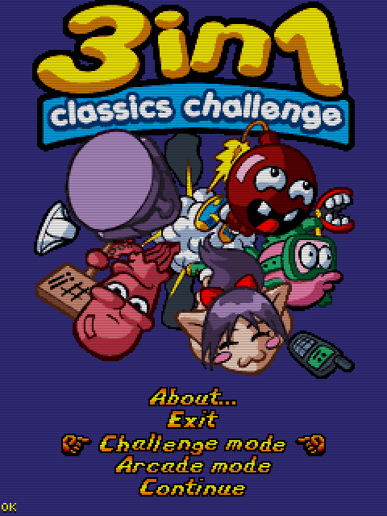

# 3 en 1 (2006)

## Descripción
Tres juegos sencillos para pasar el rato:
- 3 en raya.
- 4 en raya.
- Damas.

## Créditos
- **Programación**: 
Iñaki Roda 
Moisés Moreno

- **Gráficos**: 
Pablo A. Sánchez 
Griselda Llada

- **Musica**: 
José Vázquez

## Descargas
- [J2ME](jars/j2me/TresEnUno_240x320.jar?raw=true)
- [PC](jars/pc/TresEnUno.jar?raw=true)
