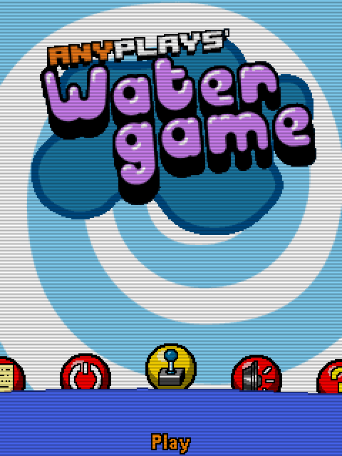

# Water Game (2007)
[</img>](screenshots/WaterGame_menu.png)
[</img>](screenshots/WaterGame_game.png)

## Descripción
Simulación de las viejas "maquinitas" de agua de los 80. Lástima que los móviles de entonces no tuvieran ningún tipo de sensor para hacerlo más realista...

## Créditos
- **Programación**: 
Moisés Moreno (juego) 
Jimmy Anttila (menús)

- **Gráficos**: 
Pablo A. Sánchez

- **Música**: 
José Vázquez

## Descargas
- [J2ME](jars/j2me/WaterGame_240x320.jar?raw=true)
- [PC](jars/pc/WaterGame.jar?raw=true)