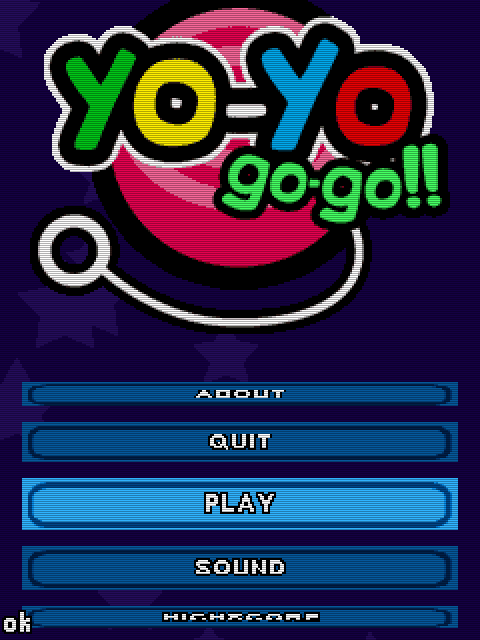

# YO-YO go-go!! (2007)

## Descripción
Simulador de Yo-Yo... Lo que viene siendo una idea de bombero. Si alguien consigue controlarlo que me avise.

## Créditos
- **Programación**: 
Jimmy Anttila 
Moisés Moreno

- **Gráficos**: 
Pablo A. Sánchez

- **Musica**: 
José Vázquez

## Descargas
- [J2ME](jars/j2me/YoYoGoGo_240x320.jar?raw=true)
- [PC](jars/pc/YoYoGoGo.jar?raw=true)
