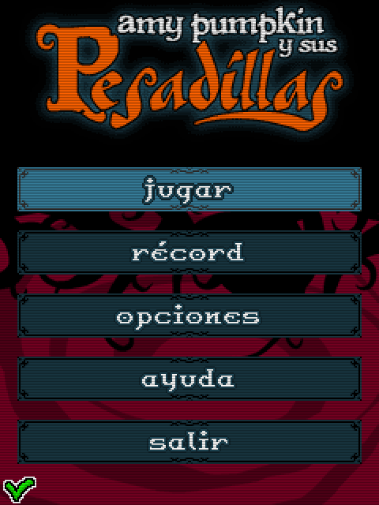
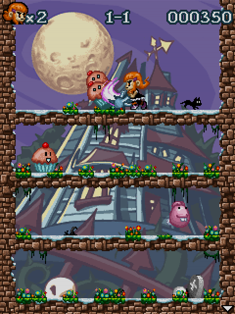

# Amy Pumpkin y sus pesadillas
Tomando como referencia juegos como Snow Bros o Rodland, nació este Amy Pumpkin con el que disfrutamos bastante en su desarrollo.

Creo que fue el último juego que hice para J2ME y probablemente el mejor técnica y visualmente hablando, aunque algo repetitivo.

[</img>](screenshots/Amy_title.png)
[</img>](screenshots/Amy_menu.png)
[</img>](screenshots/Amy_game.png)

## Créditos:
- **Programación**: Moisés Moreno
- **Gráficos**: Pablo A. Sánchez

## Descargas:
- J2ME
- [PC](jars/pc/Amy.jar?raw=true)
