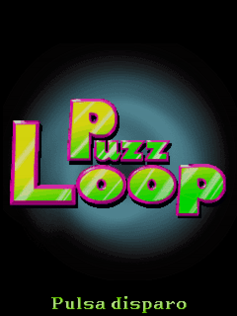

# Juegos J2ME
Desde 2005 hasta 2009 me dediqué a la programación de juegos para móviles, en su mayoría para J2ME, aunque también hice algunas versiones para BREW, DoJa o Blackberry.

En esa época desarrollé un emulador sencillo que permitía ejecutarlos en un Applet a modo de demo en cualquier web. Tiempo después programé otro emulador mejorado que terminé aparcando por falta de tiempo y de interés.

Hace unas semanas decidí retomarlo e intentar recuperar todos estos juegos para que no se pierdan en el olvido y que la gente pueda verlos y probarlos. Lamentablemente algunos aun no los he encontrado.

Algunos de ellos pueden resultar divertidos a día de hoy en un PC. Si alguien puede pasar un buen rato con alguno de ellos, me doy por satisfecho.

## Programados por mí

||||
|:---:|:---:|:---:|
 Escape del Volcán (2005) |  Sexy Puzzmaniac (2005) |  Santa Claus Revolution (2005)
 Plop! Sexy Bikinis (2006) |  El Show del Ahorcado (2006) |  Tangram (2006)
  Soccer Revolution (2006) |  Plop! Sexy Navidad (2006) |  4 en 1 - Memory Games (2007)
  El Gran Test del Amor (2007) |  Escape del Volcán 2 (2007) |  Water Game (2007)
 |  PuzzLoop (2008) |  Amy Pumpkin y sus Pesadillas (2008) |

## Colaboraciones
Juegos en los que participé o que llevan un trocito de mí (de mi código, vamos).

||||
|:---:|:---:|:---:|
 Futvoley (2005) |  3 en 1 (2006) | Action Neng (2006) 
 Crazy Petanca (2006) |  Ninja Inferno (2007) |  YO-YO go-go!! (2007)
| |  Parchís and Friends (2008)
